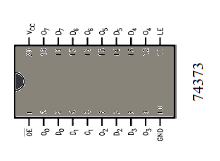

# Microcontroladores e Microprocessadores

## Aula 01

### Apresentação da Disciplina
### Breve Revisão da Arquitetura de Computadores e Apresentação de Microcontroladores e Microprocessadores

Prof. M.Sc. [Diego Ascânio Santos](mailto:ascanio@cefetmg.br)

Aula baseada nas apostilas do Prof. Dr. [Ricardo Kerschbaumer — IFC, Campus Luzerna](https://lattes.cnpq.br/5304374284779760)

CEFET-MG DECOMDV — Divinópolis, 2024

---

## Roteiro

1. Apresentação da disciplina.
2. Revisão sobre arquitetura de computadores.
    1. Fundamentos dos sistemas digitais.
    2. Registradores e memórias.
    3. Processadores.
        1. Arquitetura HARVARD vs VON NEUMANN.
        2. Arquitetura RISC vs CISC.
        3. Arquitetura interna dos processadores.
3. Microcontroladores vs Microprocessadores.

---

<!-- _class: lead -->
# Apresentação da Disciplina

---

    Apresentação da Disciplina — Objetivos

Proporcionar ao estudante conhecimentos sobre:

- Arquitetura de microprocessadores e microcontroladores;
- Unidade de controle e unidade lógica e aritmética;
- Memórias;
- Interfaces com dispositivos de entrada e saída;
- Dispositivos periféricos;
- Interrupções;
- Acesso a memórias;

- Barramentos e protocolos de comunicação;
- Aplicações de microprocessadores e microcontroladores;
- Programação de microcontroladores;
- Ferramentas para programação de microcontroladores;
- Aplicações de microcontroladores;

---

    Apresentação da Disciplina — Metodologia de Ensino 

- Aulas teóricas expositivas;
- Aulas práticas em laboratório;
- Exercícios em sala de aula;
- Trabalhos práticos em laboratório;
- Atividades avaliativas teóricas;
- Trabalho interdisciplinar (Eletrônica - Teoria e Prática);

---

    Apresentação da Disciplina — Atividades Avaliativas Teóricas

<!-- _class: centered -->

| Atividade | Valor | Data       |
| --------- | ----- | ---------- |
| AV1       | 30    | 11/04/2024 |
| AV2       | 30    | 13/06/2024 |
| AVS\*     | 30    | 04/07/2024 |
| TID-I     | 13.33 | 03/05/2024 |
| TID-II    | 13.33 | 24/05/2024 |
| TID-III   | 13.33 | 26/06/2024 |

- A AVS é uma atividade avaliativa substitutiva que substitui a menor nota entre AV1 e AV2 para os alunos que fizerem as atividades ou para os alunos que as perderem. Todo o conteúdo da disciplina será cobrado.
- AV: Avaliação; TID: Trabalho Interdisciplinar; I, II e III: partes 1, 2 e 3 do trabalho interdisciplinar.

---

    Apresentação da Disciplina — Atividades Avaliativas Práticas 

<!-- _class: centered -->
| Atividade | Valor | Data       |
| --------- | ----- | ---------- |
| TP1       | 15    | 08/05/2024 |
| TP2       | 15    | 15/05/2024 |
| TP3       | 15    | 22/05/2024 |
| TP4       | 15    | 29/05/2024 |
| TID-I     | 13.33 | 03/05/2024 |
| TID-II    | 13.33 | 24/05/2024 |
| TID-III   | 13.33 | 26/06/2024 |

**Siglas**

- TP: Trabalho Prático;
- TID: Trabalho Interdisciplinar;
- I, II e III: partes 1, 2 e 3 do trabalho interdisciplinar;

As datas das atividades avaliativas podem mudar — a critério meu e da profª Thabatta — de acordo com a conveniência da disciplina para melhor realização do trabalho interdisciplinar.

---

    Apresentação da Disciplina — Trabalho Interdisciplinar

- O trabalho Interdisciplinar consiste em três etapas:
    - **I** — Definição do problema a ser resolvido, revisão de literatura e fundamentação teórica;
    - **II** — Proposta de uma metodologia para a resolução do problema e apresentação dos resultados parciais;
    - **III** — Apresentação dos resultados finais e conclusões.

- O trabalho será desenvolvido em grupos de até 4 alunos.
- Durante a realização do trabalho vocês escreverão um relatório científico associado ao problema escolhido;

---

    Apresentação da Disciplina — Trabalho Interdisciplinar

- Artefatos de Entregas do Trabalho Interdisciplinar — Explicação Completa:

    - **I** — Relatório parcial contendo o **resumo** do problema, a caracterização do problema na sua **introdução**, os **objetivos** que se pretendem alcançar, também na **introdução**, a **fundamentação teórica**, os **trabalhos relacionados** obtidos na revisão de literatura e as **referências bibliográficas** consultadas.
    - **II** — Solução prototipada construída e o relatório parcial contendo todas as seções anteriores, acrescidas da **metodologia** proposta para a resolução do problema — descrevendo de forma detalhada e objetiva os passos desenvolvidos para resolvê-lo — bem como, os **resultados parciais** obtidos até o momento entrega e, por fim, a descrição do que ainda falta ser construído na **conclusão** parcial desta etapa. Não esquecer de adicionar nas **referências bibliográficas** quaisquer novos autores que tenham sido citados, tanto na **fundamentação teórica** e nos **trabalhos relacionados** quanto na **metodologia**.
    - **III** — Solução final construída e relatório final contendo as etapas anteriores acrescido das atualizações na **metodologia** para obtenção dos **resultados finais** obtidos (também apresentados em sua própria seção) a **discussão** destes resultados finais,  a **conclusão** do trabalho, as possibilidades de **trabalhos futuros** e, por fim, todas as **referências bibliográficas** utilizadas.

---

    Apresentação da Disciplina — Trabalho Interdisciplinar

- Artefatos de Entregas do Trabalho Interdisciplinar — Explicação Resumida:

    

- Etapa I
    - Relatório Parcial
        - Resumo
        - Introdução
            - Contextualização do Problema
            - Objetivos
        - Fundamentação Teórica (Explicação dos Conceitos que serão utilizados)
        - Trabalhos Relacionados (Autores que resolveram problemas semelhantes)
        - Referências Bibliográficas

- Etapa II
    - Relatório Parcial (da etapa I) acrescido de:
        - Metodologia
        - Resultados (parciais)
        - Conclusão (parcial)
    - Solução parcial prototipada
- Etapa III
    - Relatório Final (da etapa II) acrescido de:
        - Alterações na Metodologia
        - Resultados (finais)
            - Discussão dos Resultados
        - Conclusão
            - Trabalhos Futuros
        - Referências Bibliográficas
    - Solução final construída

---

    Apresentação da Disciplina — Trabalho Interdisciplinar

- O relatório do trabalho deverá seguir o modelo para publicação de artigos da SBC [(Sociedade Brasileira de Computação)](./arquivos/modelosparapublicaodeartigos.zip).
- O relatório deverá ser entregue em PDF e no seu respectivo formato editável (.docx, .odt ou .tex).
    - Não é obrigatória a adoção de um formato específico, mas, é fortemente recomendado que o relatório seja escrito em LaTeX.
- Durante as próximas aulas das disciplinas serão apresentadas possíveis idéias de problemas a serem resolvidos, à medida em que os conhecimentos forem adquiridos.

---

    Apresentação da Disciplina — 15 Pontos Extras

- 5 pontos extras para estudantes filiados às organizações estudantis do campus (DA, Atlética, PET, equipes de competição, dentre outras) (ambas disciplinas);
- 5 pontos extras (ambas disciplinas) para quem fizer uma doação de sangue durante o semestre (comprovada por meio de documento oficial) ou no caso da impossibilidade de doação, que cumpra algum dos seguintes requisitos:
    - Ser doador cadastrado de medula óssea;
    - Atuar como voluntário junto à comunidade divinopolitana:
        - Em instituições filantrópicas (asilos, creches, hospitais, etc);
        - Junto a projetos sociais;
        - Em escolas públicas (estaduais ou municipais) ou serviços públicos / filantrópicos de saúde;
        - No atendimento a pessoas em situação de rua (pastoral do povo de rua, ONGs, etc);
        - Em atividades de preservação do meio ambiente;
        - No atendimento a crianças, adolescentes, mulheres, idosos, PCDs, pessoas LGBTQIA+ ou em situação de vulnerabilidade social;
        - Na promoção de ações em busca de igualdade racial e de gênero;
        - Na articulação política junto às lideranças em mandato (e não mandatárias) da cidade;
- 5 pontos extras para alunos que entregarem o relatório do TID no formato LaTeX (laboratório);
- 5 pontos extras para alunos que ajudarem na realização da semana da computação (teoria);

---

<!-- _class: lead -->
# Revisão Sobre Arquitetura de Computadores
## Fundamentos dos sistemas Digitais

---

    Revisão sobre arquitetura de computadores - Fundamentos de Sistemas Digitais

**Objetivo**: revisar tópicos elementares de eletrônica digital necessários ao estudo de microcontroladores.

1. Sinais Analógicos e Digitais
2. Portas Lógicas

---

    Fundamentos — Sinais Analógicos e Digitais

- Todos os sinais dos circuitos são elétricos. Porém, podem ser classificados em dois tipos:
    - Analógicos
    - Digitais

- Sinais analógicos são contínuos e podem assumir qualquer valor dentro de um intervalo.
- Sinais digitais são discretos e podem assumir apenas valores específicos. Nos sistemas digitais, que trabalham com a lógica booleana, os sinais podem assumir apenas dois valores:

0. **(baixo)**
1. **(alto)**

<figure>

<!-- _class: transparent -->

<figcaption>Figura 1: Sinal Analógico</figcaption>
</figure>

<figure>

<figcaption>Figura 2: Sinal Digital</figcaption>
</figure>

---

    Fundamentos — Portas Lógicas

    
- A relação entre variáveis booleanas é chamada de **operação lógica**.
- Portas digitais lógicas são os circuitos eletrônicos que as realizam, como mostrado na figura 3:

<figure>

<!-- _class: transparent -->

<figcaption>Figura 3: Portas (operações) lógicas e suas tabelas verdade.</figcaption>
</figure>

---

<!-- _class: lead -->
# Revisão Sobre Arquitetura de Computadores
## Registradores e Memória

---

    Arquitetura de Computadores - Registradores

- Registradores são grupos de flip-flops capazes de armazenar um número finito de bits.
    - Flip-flops, no contexto presente, são dispositivos capazes de armazenar um bit de informação.
    - Registradores são compostos pela associação de flip-flops.

- O número finito de bits armazenado por um registrador é definido pela quantidade de flip-flops que o compõem.
- Registradores são fundamentais aos micro (processadores | controladores) por serem capazes de armazenar informações.
- As figuras 4 e 5 mostram respectivamente um flip-flop do tipo D e um registrador de 4 bits.

<figure>

<!-- _class: transparent -->

<figcaption>Figura 4 - Flip-flop do tipo D</figcaption>
</figure>
<figure>

<!-- _class: transparent -->

<figcaption>Figura 5 - Registrador de 4 bits composto por Flip-Flops do tipo D</figcaption>
</figure>

---

    Arquitetura de Computadores - Registrador Comercial 74373

- O 74373 é um registrador comercial de 8 bits composto por 8 bits de entrada e 8 bits de saída, ambos paralelos, como mostrado pela figura 6.
    - Os pinos `D0 - D7` são as entradas de dados, enquanto os pinos `O0 - O7` são as saídas de dados.
    - O pino `OE` é o pino de habilitação de saída, que quando em nível lógico baixo, habilita a saída (leitura) dos dados.
    - Já o pino `LE` é o pino de habilitação de escrita, que quando em nível lógico alto, habilita a gravação (entrada) dos dados no registrador.

<figure>

<!-- _class: transparent -->

<figcaption>Figura 6 - Registrador Comercial 74373 </figcaption>
</figure>

---

    Arquitetura de Computadores - Funcionamento do Registrador Comercial 74373

- Considerando os pinos de controle para gravação \\((LE)\\) e leitura \\((\\overline{OE})\\) de dados do registrador 74373, quando a leitura está habilitada \\((LE = 1)\\) e a gravação habilitada \\((OE = 0)\\), a saída do n-ésimo bit do registrador representada por \\(O_{n}\\) tem o mesmo valor da entrada \\(D_{n}\\).
-   Quando a gravação está habilitada \\((OE = 0)\\) e a leitura desabilitada \\((LE = 0)\\), a saída do n-ésimo bit do registrador não muda, pois, nenhum comando de leitura — \\(LE = 1\\) — foi aplicado ao registrador.
- Quando a gravação está desabilitada \\((OE = 1)\\), independentemente do estado do pino de controle de leitura, a saída do registrador é mantida em alta impedância, ou seja, não é possível nem ler nem gravar o valor armazenado no registrador, já que o pino \\(O\_{n}\\) quando em alta impedância se comporta como um circuito aberto, desconectado do circuito.
    - A Tabela 1, que representa a tabela verdade do registrador 74373 simplifica o entendimento das operações descritas acima.
- Apesar de termos usado o registrador 74373 como exemplo, as explicações aqui contidas generalizam para outros registradores de \\(n\\) bits.
- Por fim, a lógica do registrador 74373 com os componentes que o compõem é ilustrada pela Figura 7, presente no próximo slide.

<table>
    <caption style="caption-side: bottom;">Tabela 1 - Tabela verdade do registrador 74373</caption>
    <tr>
        <th colspan="3">ENTRADAS</th>
        <th>SAÍDAS</th>
    </tr>
    <tr>
        <th>\(LE\)</th>
        <th>\(\overline{OE}\)</th>
        <th>\(D_{n}\)</th>
        <th>\(O_{n}\)</th>
    </tr>
    <tr>
        <td>1</td>
        <td>0</td>
        <td>1</td>
        <td>1</td>
    </tr>
    <tr>
        <td>1</td>
        <td>0</td>
        <td>0</td>
        <td>0</td>
    </tr>
    <tr>
        <td>0</td>
        <td>0</td>
        <td>X</td>
        <td>Não Muda</td>
    </tr>
    <tr>
        <td>X</td>
        <td>1</td>
        <td>X</td>
        <td>\(Z\) (Alta impedância)</td>
    </tr>
</table>

---

    Arquitetura de Computadores - Funcionamento do Registrador Comercial 74373

<figure>
    
    <figcaption style="text-align: center;">Figura 7: Lógica interna do Registrador Comercial 74373</figcaption>
</figure>

---

    Arquitetura de Computadores — Memória

Com um registrador, é possível armazenar uma palavra (informação) de \\(n\\) bits. Com a memória, podemos armazenar milhares, milhões, bilhões delas. A memória é um dispositivo que armazena informações para serem lidas e escritas. Ela é composta por células de memória, que são organizadas em endereços. Cada célula de memória armazena uma palavra de \\(n\\) bits.

Para compor as células de memória, podem ser utilizados dispositivos como flip-flops, registradores ou quaisquer outros que sirvam para o mesmo fim, tais quais: capacitores, transistores, etc. Os circuitos de memória normalmente possuem os seguintes componentes:

- Vias de dados (\\(IO_{n}\\)), que são utilizadas para ler e armazenar palavras binárias na memória — entrada e saída de dados — sendo comumente bidirecionais.
- Vias de endereços (\\(A_{n}\\)), que são utilizadas para selecionar a célula de memória que se deseja ler ou escrever de acordo com seu endereço.
- Uma entrada (*Chip Select* — \\(CS\\)) que habilita ou desabilita a memória para leitura ou escrita. Quando desabilitada, a memória não pode ser acessada e se comporta no circuito elétrico como um elemento de alta impedância, ou seja, como se não estivesse conectada ao circuito.
- Uma entrada (*Write Enable* — \\(WE\\)) para habilitar o modo da operação (leitura ou escrita) desejada, quando permitido.

A Figura 8, ao lado, ilustra um circuito típico de memória com capacidade para armazenar 1024 palavras de 8 bits cada.

<figure>

<!-- _class: transparent -->

<figcaption>Figura 8 — Circuito de memória com capacidade para armazenar 1024 palavras de 8 bits cada.</figcaption>
</figure>

---

    Arquitetura de Computadores — Determinação da Capacidade de Armazenamento de uma Memória

- Como saber a quantidade de palavras que uma memória pode armazenar?
    - Através da quantidade de pinos de endereço que a memória possui:
\\[
\\begin{align}
    & \\text{qtd palavras} = 2^{\\text{n}}, \\\\
    & \\text{onde n é a quantidade de pinos de endereço}
\\end{align}
\\]

- Como saber quantos bits a memória pode armazenar?
    - Através da quantidade de pinos de dados \\((IO)\\) que a memória possui.

- Qual a capacidade da memória, em bits?
    - A capacidade da memória, em bits, é dada pela multiplicação da quantidade de palavras pela quantidade de bits por palavra, ou seja:
\\[
\\begin{align}
    & \\text{capacidade} = \\text{qtd palavras} \\times \\text{qtd bits por palavra}
\\end{align}
\\]
    - Em bytes, é dada pela fórmula anterior dividida por 8.

---

    Memórias — Tipos de Memórias

Existem diversos tipos de memórias, cada uma com suas características e aplicações. As relevenates para o contexto da disciplina — abordadas nos próximos slides — são:

- RAM
- ROM
- PROM
- EPROM e EEPROM
- Flash

