

# Microcontroladores e Microprocessadores

## Aula 01

### Apresentação da Disciplina
### Breve Revisão da Arquitetura de Computadores e Apresentação de Microcontroladores e Microprocessadores

Prof. M.Sc. [Diego Ascânio Santos](mailto:ascanio@cefetmg.br)

Aula baseada nas apostilas do Prof. Dr. [Ricardo Kerschbaumer — IFC, Campus Luzerna](https://lattes.cnpq.br/5304374284779760)

CEFET-MG DECOMDV — Divinópolis, 2024

---

## Roteiro

1. Apresentação da disciplina.
2. Revisão sobre arquitetura de computadores.
    1. Fundamentos dos sistemas digitais.
    2. Registradores e memórias.
    3. Componentes básicos de um sistema computacional.
    4. Microprocessadores.
        1. Arquitetura interna dos processadores.
        2. Arquitetura HARVARD vs VON NEUMANN.
        3. Arquitetura RISC vs CISC.
3. Microcontroladores vs Microprocessadores.

---

<!-- _class: lead -->
# Apresentação da Disciplina

---

    Apresentação da Disciplina — Objetivos

Proporcionar ao estudante conhecimentos sobre:

- Arquitetura de microprocessadores e microcontroladores;
- Unidade de controle e unidade lógica e aritmética;
- Memórias;
- Interfaces com dispositivos de entrada e saída;
- Dispositivos periféricos;
- Interrupções;
- Acesso a memórias;

- Barramentos e protocolos de comunicação;
- Aplicações de microprocessadores e microcontroladores;
- Programação de microcontroladores;
- Ferramentas para programação de microcontroladores;
- Aplicações de microcontroladores;

---

    Apresentação da Disciplina — Metodologia de Ensino 

- Aulas teóricas expositivas;
- Aulas práticas em laboratório;
- Exercícios em sala de aula;
- Trabalhos práticos em laboratório;
- Atividades avaliativas teóricas;
- Trabalho interdisciplinar (Eletrônica - Teoria e Prática);

---

    Apresentação da Disciplina — Atividades Avaliativas Teóricas

<!-- _class: centered -->

| Atividade | Valor | Data       |
| --------- | ----- | ---------- |
| AV1       | 30    | 11/04/2024 |
| AV2       | 30    | 13/06/2024 |
| AVS\*     | 30    | 04/07/2024 |
| TID-I     | 13.33 | 03/05/2024 |
| TID-II    | 13.33 | 24/05/2024 |
| TID-III   | 13.33 | 26/06/2024 |

- A AVS é uma atividade avaliativa substitutiva que substitui a menor nota entre AV1 e AV2 para os alunos que fizerem as atividades ou para os alunos que as perderem. Todo o conteúdo da disciplina será cobrado.
- AV: Avaliação; TID: Trabalho Interdisciplinar; I, II e III: partes 1, 2 e 3 do trabalho interdisciplinar.

---

    Apresentação da Disciplina — Atividades Avaliativas Práticas 

<!-- _class: centered -->
| Atividade | Valor | Data       |
| --------- | ----- | ---------- |
| TP1       | 15    | 08/05/2024 |
| TP2       | 15    | 15/05/2024 |
| TP3       | 15    | 22/05/2024 |
| TP4       | 15    | 29/05/2024 |
| TID-I     | 13.33 | 03/05/2024 |
| TID-II    | 13.33 | 24/05/2024 |
| TID-III   | 13.33 | 26/06/2024 |

**Siglas**

- TP: Trabalho Prático;
- TID: Trabalho Interdisciplinar;
- I, II e III: partes 1, 2 e 3 do trabalho interdisciplinar;

As datas das atividades avaliativas podem mudar — a critério meu e da profª Thabatta — de acordo com a conveniência da disciplina para melhor realização do trabalho interdisciplinar.

---

    Apresentação da Disciplina — Trabalho Interdisciplinar

- O trabalho Interdisciplinar consiste em três etapas:
    - **I** — Definição do problema a ser resolvido, revisão de literatura e fundamentação teórica;
    - **II** — Proposta de uma metodologia para a resolução do problema e apresentação dos resultados parciais;
    - **III** — Apresentação dos resultados finais e conclusões.

- O trabalho será desenvolvido em grupos de até 4 alunos.
- Durante a realização do trabalho vocês escreverão um relatório científico associado ao problema escolhido;

---

    Apresentação da Disciplina — Trabalho Interdisciplinar

- Artefatos de Entregas do Trabalho Interdisciplinar — Explicação Completa:

    - **I** — Relatório parcial contendo o **resumo** do problema, a caracterização do problema na sua **introdução**, os **objetivos** que se pretendem alcançar, também na **introdução**, a **fundamentação teórica**, os **trabalhos relacionados** obtidos na revisão de literatura e as **referências bibliográficas** consultadas.
    - **II** — Solução prototipada construída e o relatório parcial contendo todas as seções anteriores, acrescidas da **metodologia** proposta para a resolução do problema — descrevendo de forma detalhada e objetiva os passos desenvolvidos para resolvê-lo — bem como, os **resultados parciais** obtidos até o momento entrega e, por fim, a descrição do que ainda falta ser construído na **conclusão** parcial desta etapa. Não esquecer de adicionar nas **referências bibliográficas** quaisquer novos autores que tenham sido citados, tanto na **fundamentação teórica** e nos **trabalhos relacionados** quanto na **metodologia**.
    - **III** — Solução final construída e relatório final contendo as etapas anteriores acrescido das atualizações na **metodologia** para obtenção dos **resultados finais** obtidos (também apresentados em sua própria seção) a **discussão** destes resultados finais,  a **conclusão** do trabalho, as possibilidades de **trabalhos futuros** e, por fim, todas as **referências bibliográficas** utilizadas.

---

    Apresentação da Disciplina — Trabalho Interdisciplinar

- Artefatos de Entregas do Trabalho Interdisciplinar — Explicação Resumida:

    

- Etapa I
    - Relatório Parcial
        - Resumo
        - Introdução
            - Contextualização do Problema
            - Objetivos
        - Fundamentação Teórica (Explicação dos Conceitos que serão utilizados)
        - Trabalhos Relacionados (Autores que resolveram problemas semelhantes)
        - Referências Bibliográficas

- Etapa II
    - Relatório Parcial (da etapa I) acrescido de:
        - Metodologia
        - Resultados (parciais)
        - Conclusão (parcial)
    - Solução parcial prototipada
- Etapa III
    - Relatório Final (da etapa II) acrescido de:
        - Alterações na Metodologia
        - Resultados (finais)
            - Discussão dos Resultados
        - Conclusão
            - Trabalhos Futuros
        - Referências Bibliográficas
    - Solução final construída

---

    Apresentação da Disciplina — Trabalho Interdisciplinar

- O relatório do trabalho deverá seguir o modelo para publicação de artigos da SBC [(Sociedade Brasileira de Computação)](./arquivos/modelosparapublicaodeartigos.zip).
- O relatório deverá ser entregue em PDF e no seu respectivo formato editável (.docx, .odt ou .tex).
    - Não é obrigatória a adoção de um formato específico, mas, é fortemente recomendado que o relatório seja escrito em LaTeX.
- Durante as próximas aulas das disciplinas serão apresentadas possíveis idéias de problemas a serem resolvidos, à medida em que os conhecimentos forem adquiridos.

---

    Apresentação da Disciplina — 15 Pontos Extras

- 5 pontos extras para estudantes filiados às organizações estudantis do campus (DA, Atlética, PET, equipes de competição, dentre outras) (ambas disciplinas);
- 5 pontos extras (ambas disciplinas) para quem fizer uma doação de sangue durante o semestre (comprovada por meio de documento oficial) ou no caso da impossibilidade de doação, que cumpra algum dos seguintes requisitos:
    - Ser doador cadastrado de medula óssea;
    - Atuar como voluntário junto à comunidade divinopolitana:
        - Em instituições filantrópicas (asilos, creches, hospitais, etc);
        - Junto a projetos sociais;
        - Em escolas públicas (estaduais ou municipais) ou serviços públicos / filantrópicos de saúde;
        - No atendimento a pessoas em situação de rua (pastoral do povo de rua, ONGs, etc);
        - Em atividades de preservação do meio ambiente;
        - No atendimento a crianças, adolescentes, mulheres, idosos, PCDs, pessoas LGBTQIA+ ou em situação de vulnerabilidade social;
        - Na promoção de ações em busca de igualdade racial e de gênero;
        - Na articulação política junto às lideranças em mandato (e não mandatárias) da cidade;
- 5 pontos extras para alunos que entregarem o relatório do TID no formato LaTeX (laboratório);
- 5 pontos extras para alunos que ajudarem na realização da semana da computação (teoria);

---

<!-- _class: lead -->
# Revisão Sobre Arquitetura de Computadores
## Fundamentos dos sistemas Digitais

---

    Revisão sobre arquitetura de computadores - Fundamentos de Sistemas Digitais

**Objetivo**: revisar tópicos elementares de eletrônica digital necessários ao estudo de microcontroladores.

1. Sinais Analógicos e Digitais
2. Portas Lógicas

---

    Fundamentos — Sinais Analógicos e Digitais

- Todos os sinais dos circuitos são elétricos. Porém, podem ser classificados em dois tipos:
    - Analógicos
    - Digitais

- Sinais analógicos são contínuos e podem assumir qualquer valor dentro de um intervalo.
- Sinais digitais são discretos e podem assumir apenas valores específicos. Nos sistemas digitais, que trabalham com a lógica booleana, os sinais podem assumir apenas dois valores:

0. **(baixo)**
1. **(alto)**

<figure>

<!-- _class: transparent -->
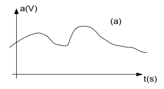

<figcaption>Figura 1: Sinal Analógico</figcaption>
</figure>

<figure>

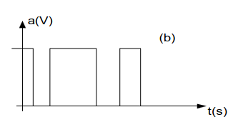

<figcaption>Figura 2: Sinal Digital</figcaption>
</figure>

---

    Fundamentos — Portas Lógicas

    
- A relação entre variáveis booleanas é chamada de **operação lógica**.
- Portas digitais lógicas são os circuitos eletrônicos que as realizam, como mostrado na figura 3:

<figure>

<!-- _class: transparent -->
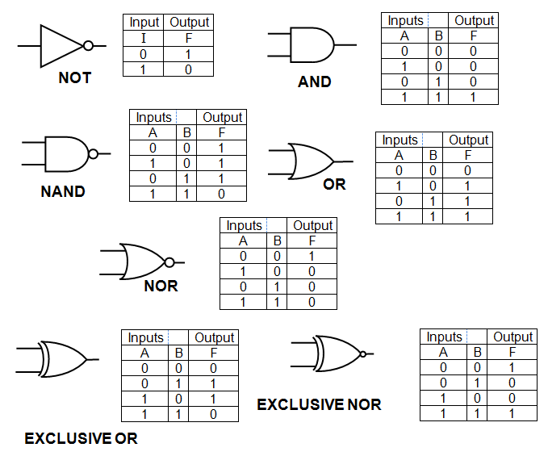

<figcaption>Figura 3: Portas (operações) lógicas e suas tabelas verdade.</figcaption>
</figure>

---

<!-- _class: lead -->
# Revisão Sobre Arquitetura de Computadores
## Registradores e Memória

---

    Arquitetura de Computadores - Registradores

- Registradores são grupos de flip-flops capazes de armazenar um número finito de bits.
    - Flip-flops, no contexto presente, são dispositivos capazes de armazenar um bit de informação.
    - Registradores são compostos pela associação de flip-flops.

- O número finito de bits armazenado por um registrador é definido pela quantidade de flip-flops que o compõem.
- Registradores são fundamentais aos micro (processadores | controladores) por serem capazes de armazenar informações.
- As figuras 4 e 5 mostram respectivamente um flip-flop do tipo D e um registrador de 4 bits.

<figure>

<!-- _class: transparent -->
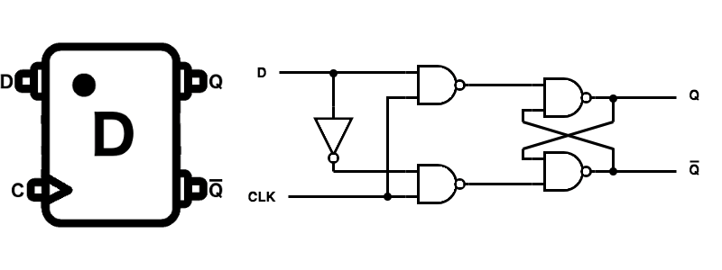

<figcaption>Figura 4 - Flip-flop do tipo D</figcaption>
</figure>
<figure>

<!-- _class: transparent -->

<figcaption>Figura 5 - Registrador de 4 bits composto por Flip-Flops do tipo D</figcaption>
</figure>

---

    Arquitetura de Computadores - Registrador Comercial 74373

- O 74373 é um registrador comercial de 8 bits composto por 8 bits de entrada e 8 bits de saída, ambos paralelos, como mostrado pela figura 6.
    - Os pinos `D0 - D7` são as entradas de dados, enquanto os pinos `O0 - O7` são as saídas de dados.
    - O pino `OE` é o pino de habilitação de saída, que quando em nível lógico baixo, habilita a saída (leitura) dos dados.
    - Já o pino `LE` é o pino de habilitação de escrita, que quando em nível lógico alto, habilita a gravação (entrada) dos dados no registrador.

<figure>

<!-- _class: transparent -->

<figcaption>Figura 6 - Registrador Comercial 74373 </figcaption>
</figure>

---

    Arquitetura de Computadores - Funcionamento do Registrador Comercial 74373

- Considerando os pinos de controle para gravação \\((LE)\\) e leitura \\((\\overline{OE})\\) de dados do registrador 74373, quando a leitura está habilitada \\((LE = 1)\\) e a gravação habilitada \\((OE = 0)\\), a saída do n-ésimo bit do registrador representada por \\(O_{n}\\) tem o mesmo valor da entrada \\(D_{n}\\).
-   Quando a gravação está habilitada \\((OE = 0)\\) e a leitura desabilitada \\((LE = 0)\\), a saída do n-ésimo bit do registrador não muda, pois, nenhum comando de leitura — \\(LE = 1\\) — foi aplicado ao registrador.
- Quando a gravação está desabilitada \\((OE = 1)\\), independentemente do estado do pino de controle de leitura, a saída do registrador é mantida em alta impedância, ou seja, não é possível nem ler nem gravar o valor armazenado no registrador, já que o pino \\(O\_{n}\\) quando em alta impedância se comporta como um circuito aberto, desconectado do circuito.
    - A Tabela 1, que representa a tabela verdade do registrador 74373 simplifica o entendimento das operações descritas acima.
- Apesar de termos usado o registrador 74373 como exemplo, as explicações aqui contidas generalizam para outros registradores de \\(n\\) bits.
- Por fim, a lógica do registrador 74373 com os componentes que o compõem é ilustrada pela Figura 7, presente no próximo slide.

<table>
    <caption style="caption-side: bottom;">Tabela 1 - Tabela verdade do registrador 74373</caption>
    <tr>
        <th colspan="3">ENTRADAS</th>
        <th>SAÍDAS</th>
    </tr>
    <tr>
        <th>\(LE\)</th>
        <th>\(\overline{OE}\)</th>
        <th>\(D_{n}\)</th>
        <th>\(O_{n}\)</th>
    </tr>
    <tr>
        <td>1</td>
        <td>0</td>
        <td>1</td>
        <td>1</td>
    </tr>
    <tr>
        <td>1</td>
        <td>0</td>
        <td>0</td>
        <td>0</td>
    </tr>
    <tr>
        <td>0</td>
        <td>0</td>
        <td>X</td>
        <td>Não Muda</td>
    </tr>
    <tr>
        <td>X</td>
        <td>1</td>
        <td>X</td>
        <td>\(Z\) (Alta impedância)</td>
    </tr>
</table>

---

    Arquitetura de Computadores - Funcionamento do Registrador Comercial 74373

<figure>
    
    <figcaption style="text-align: center;">Figura 7: Lógica interna do Registrador Comercial 74373</figcaption>
</figure>

---

    Arquitetura de Computadores — Memória

Com um registrador, é possível armazenar uma palavra (informação) de \\(n\\) bits. Com a memória, podemos armazenar milhares, milhões, bilhões delas. A memória é um dispositivo que armazena informações para serem lidas e escritas. Ela é composta por células de memória, que são organizadas em endereços. Cada célula de memória armazena uma palavra de \\(n\\) bits.

Para compor as células de memória, podem ser utilizados dispositivos como flip-flops, registradores ou quaisquer outros que sirvam para o mesmo fim, tais quais: capacitores, transistores, etc. Os circuitos de memória normalmente possuem os seguintes componentes:

- Vias de dados (\\(IO_{n}\\)), que são utilizadas para ler e armazenar palavras binárias na memória — entrada e saída de dados — sendo comumente bidirecionais.
- Vias de endereços (\\(A_{n}\\)), que são utilizadas para selecionar a célula de memória que se deseja ler ou escrever de acordo com seu endereço.
- Uma entrada (*Chip Select* — \\(CS\\)) que habilita ou desabilita a memória para leitura ou escrita. Quando desabilitada, a memória não pode ser acessada e se comporta no circuito elétrico como um elemento de alta impedância, ou seja, como se não estivesse conectada ao circuito.
- Uma entrada (*Write Enable* — \\(WE\\)) para habilitar o modo da operação (leitura ou escrita) desejada, quando permitido.

A Figura 8, ao lado, ilustra um circuito típico de memória com capacidade para armazenar 1024 palavras de 8 bits cada.

<figure>

<!-- _class: transparent -->

<figcaption>Figura 8 — Circuito de memória com capacidade para armazenar 1024 palavras de 8 bits cada.</figcaption>
</figure>

---

    Arquitetura de Computadores — Determinação da Capacidade de Armazenamento de uma Memória

- Como saber a quantidade de palavras que uma memória pode armazenar?
    - Através da quantidade de pinos de endereço que a memória possui:
\\[
\\begin{align}
    & \\text{qtd palavras} = 2^{\\text{n}}, \\\\
    & \\text{onde n é a quantidade de pinos de endereço}
\\end{align}
\\]

- Como saber quantos bits a memória pode armazenar?
    - Através da quantidade de pinos de dados \\((IO)\\) que a memória possui.

- Qual a capacidade da memória, em bits?
    - A capacidade da memória, em bits, é dada pela multiplicação da quantidade de palavras pela quantidade de bits por palavra, ou seja:
\\[
\\begin{align}
    & \\text{capacidade} = \\text{qtd palavras} \\times \\text{qtd bits por palavra}
\\end{align}
\\]
    - Em bytes, é dada pela fórmula anterior dividida por 8.

---

    Memórias — Tipos de Memórias

Existem diversos tipos de memórias, cada uma com suas características e aplicações. As relevenates para o contexto da disciplina — abordadas nos próximos slides — são:

- RAM
- ROM
- PROM
- EPROM e EEPROM
- Flash

---

    Memórias — Memória RAM

**Memória RAM — Memória de Acesso Aleatório**

- A memória RAM (Random Access Memory) é uma memória de leitura e escrita. Um exemplo de memória RAM é demonstrado pela Figura 9.
    - Pode ter armazenada (em si) um determinado valor e, a *posteriori*, retornar tal valor em uma operação de leitura.
    - Tem esse nome porque o acesso a qualquer posição de memória é feito de forma aleatória (*random*).
    - Os dados na memória RAM são persistidos somente quando a memória está funcionando, por isso, diz-se que a memória RAM é uma memória volátil.
    - São categorizadas em dois tipos:
        1. Estáticas.
        2. Dinâmicas.

<figure>

<!-- _class: transparent -->

<figcaption>

Figura 9 — Memória Ram DDR3 Utilizada em *Notebooks*

</figcaption>

</figure>

---

    Memórias — Memória RAM

## Memórias RAM estáticas (SRAM)

- Os bits são armazenados em flip-flops individuais.
    - Permanecem armazenados enquanto a SRAM for energizada.

A Figura 10 ilustra uma célula de memória SRAM construída com flip-flops.

## Memórias RAM dinâmicas (DRAM)

- Armazenam os bits em capacitores de dimensões nanométricas (através de carga / descarga).
- Capacitores nanométricos ocupam muito menos espaço que flip-flops, por isso, DRAM são muito mais **densas** (e compactas) que SRAM.
    - Entretanto, os capacitores nanométricos perdem carga com o tempo, por isso, os capacitores da DRAM precisam ser reenergizados constantemente, se necessário.
    - A atualização constante é feita por um circuito chamado de *refresh*.

A Figura 11 mostra o diagrama de circuito de uma memória DRAM.

<figure>

<!-- _class: transparent -->

<figcaption>

Figura 10 — Célula de memória SRAM.

</figcaption>

</figure>
<figure>

<!-- _class: transparent -->

<figcaption>

Figura 11 — Circuito de uma memória DRAM.

</figcaption>

</figure>

---

    Memórias — Memória RAM

- Como visto anteriormente, a maioria das memórias RAMS dispõem de uma entrada de controle chamada *Chip Select* (`CS`) — destacada na Figura 12 — utilizada para habilitar (ou desabilitar) a memória no circuito.
    - Dispor desta entrada permite que sejam utilizadas várias memórias RAMS em paralelo, num mesmo circuito, sem que haja conflito entre elas.
        - Isto para que seja melhorada a capacidade de armazenamento e manuseio de dados.
    - Quando a memória encontra-se desabilitada \\((\\text{CS} = 1)\\), ela assume estado de alta impedância, fazendo com que esteja desconectada de demais componentes do circuito.
        - Nesta ocorrência, não é possível ler ou escrever dados na memória.
- Além desta entrada de controle, as RAMS dispõem de entrada de habilitação de escrita / leitura (`WE`), pinos de endereço \\(A_{n}\\) e de dados \\(\\text{IO}_{n}\\) como também visto anteriormente.
- É sempre importante conhecer o *datasheet* da memória que se está utilizando, pois, os níveis lógicos das entradas de controle podem variar de acordo com o fabricante.

<figure>

<!-- _class: transparent -->
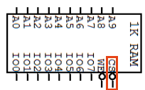

<figcaption>Figura 12 — Entrada de controle CS (destacada em vermelho) em uma Memória de RAM 1KB.</figcaption>

</figure>

---

    Memórias — Memória RAM

## Memória RAM — Funcionamento

### Escrita

Para escrever dados na memória RAM é necessário:

1. Habilitar o chip de memória `CS = 0` (em vermelho na Figura 13).
2. Colocar a palavra (a informação) que se deseja armazenar no barramento de dados `I/O` (em azul na Figura 13).
3. Colocar o endereço da célula de memória onde se deseja armazenar a palavra no barramento de endereços `A` (em verde na Figura 13).
4. Habilitar o sinal de escrita \\(\\overline{\\text{WE}} = 0\\) (em amarelo na Figura 13).

A partir desse momento, o dado já está armazenado na memória.

### Leitura

Para ler dados da memória RAM é necessário:

1. Habilitar o chip de memória `CS = 0`.
2. Colocar o endereço da célula de memória que se deseja ler no barramento de endereços `A`.
3. Habilitar o sinal de leitura \\(\\overline{\\text{WE}} = 1\\).

A partir desse momento, o dado que estava armazenado na célula de memória selecionada é colocado no barramento de dados `I/O`.
Considere as mesmas referências de cores na Figura 13 descritas na operação de escrita.

<figure>

<!-- _class: transparent -->
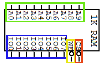

<figcaption>Figura 13 — Memória de RAM 1KB com barramentos de dados, endereços e pinos de controle destacados.</figcaption>

</figure>

---

    Memórias — Memória ROM

- A memória ROM (Read Only Memory) é uma memória de leitura, ou seja, os dados nela contidos não podem ser alterados. Ela é usada para armazenar programas que não precisam ser alterados, como o BIOS de um computador.
- Os conteúdos da ROM são não voláteis, ou seja, não são perdidos quando a energia é desligada.
- Também são fixos e inalteráveis, sendo gravados durante a fabricação do chip.
    - Portanto, não são necessários dispositivos de armazenamento de estados como *latches* ou *flip-flops*, o que torna a ROM mais barata e mais simples do que a RAM.
- Pode-se considerar que uma ROM é um siples conversor de endereços para dados, onde o endereço é a entrada e o dado é a saída.

---

    Memórias — Memória PROM

- A memória PROM (Programmable Read-Only Memory) é uma memória de leitura que pode ser programada uma única vez.
- Ela é feita de um conjunto de microfusíveis que podem ser abertos (queimados) ou fechados (mantidos) para representar os bits de um dado.
- A programação é feita por um dispositivo que aplica uma alta tensão para queimar os fusíveis.
- Uma vez programada, a memória PROM não pode ser reprogramada.
- Toda memória ROM foi uma PROM até ser fabricada?

---

    Memórias — Memória EPROM

- Erasable and Programmable Read-Only Memory (EPROM) é um tipo de memória de leitura que pode ser apagada e reprogramada.
- Seus dados são armazenados em dispositivos baseados em transistores MOSFET de portas flutuantes (*Floating Gate MOSFET*).
    - Um transistor é uma chave digital (interruptor) que pode ser ligada ou desligada a partir de um sinal elétrico aplicado em seu terminal de controle (normalmente a base).
        - Quando a chave está ligada, a corrente elétrica pode fluir entre os terminais de entrada e saída do transistor (normalmente coletor e emissor) e se existe fluxo de corrente, logo, existe tensão \\((V = R \cdot I)\\). Portanto, entre os terminais de entrada e saída do transistor, que representam um bit, se existe um valor de tensão, logo existe um nível lógico alto (ou 1).
        - Quando a chave está desligada, a corrente elétrica não flui entre os terminais de entrada e saída do transistor, portanto, não existe fluxo de corrente. Se não existe corrente, a tensão entre os terminais é zero. Portanto, entre os terminais de entrada e saída do transistor, que representam um bit, se não existe um valor de tensão, logo existe um nível lógico baixo (ou 0).
    - Para programar uma EPROM é necessário um dispositivo chamado de programador de EPROM.
- Mas como apagar EPROMS?
    - Quando MOSFETS são expostos a uma luz UV forte por um determinado período de tempo (apx. 30 min.) ocorre uma fuga de cargas elétricas que estavam armazenadas nas portas flutuantes dos transistores, fazendo com que eles voltem ao estado original, ou seja, apagando os dados.
        - As portas flutuantes são capazes de armazenar cargas elétricas por um longo período de tempo, mesmo sem alimentação elétrica.
- As Figuras 14 e 15 mostram, respectivamente, o diagrama da memória comercial EPROM 2764 e sua embalagem (sua casca) com janela de quartzo (no centro) para exposição à luz UV.

<figure>

<!-- _class: transparent -->

<figcaption> Figura 14 — EPROM 2764 </figcaption>
</figure>
<figure>

<!-- _class: transparent -->

<figcaption> Figura 15 — Embalagem da EPROM 2764 </figcaption>
</figure>

---

    Memórias — EEPROM e Flash

- EEPROM — Electrically Erasable Programmable Read-Only Memory — e Flash são memórias apagáveis e programáveis eletricamente.
    - Benefícios:
        - Não necessitam de remoção para programação.
        - Podem ser programadas e apagadas no circuito.
        - Podem ser reprogramadas muitas vezes.
    - Diferenças:
        - EEPROM — apagamento e programação por byte, mais flexível, mais lenta, mais cara.
        - Flash — apagamento e programação por bloco, menos flexível, mais rápida, mais barata.
    - Casos de uso:
        - Atualização frequente de pequenas quantidades de dados com alta flexibilidade: EEPROM.
        - Armazenamento em massa de dados que demandam rapidez na escrita: Flash.

<figure>

<!-- _class: transparent -->

<figcaption> Figura 16 — EEPROM 24C64 </figcaption>
</figure>
<figure>

<!-- _class: transparent -->

<figcaption> Figura 17 — Dispositivo de Armazenamento USB (majoritariamente baseados em memórias Flash) </figcaption>
</figure>

---

    Memórias — Associação de Memórias

- Quando o número de palavras ou número de bits por palavra em um sistema de memória não é suficiente, pode-se associar memórias para aumentar estas grandezas.
- Imagine que seja necessário operar palavras de 16 bits, mas, que a memória disponível seja de 8 bits. Pode-se associar duas memórias de 8 bits para formar uma memória de 16 bits como ilustrado pela Figura 18.

<figure>

<!-- _class: transparent -->
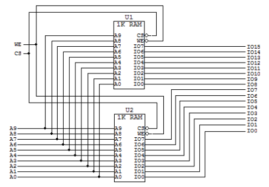

<figcaption> Figura 18 — Associação de memórias para aumentar a quantidade de bits por palavra </figcaption>
</figure>

---

    Memórias — Associação de Memórias

- Assuma agora que sua aplicação demande o armazenamento de 2048 palavras de 8 bits cada, mas, que os CIs de memória disponíveis consigam armazenar apenas 1024 palavras de 8 bits cada. Como você faria para atender a essa demanda?
    - Com a construção de um mux de 2 bits, é possível associar dois CIs de memória de 1024 palavras de 8 bits cada, de forma que, ao selecionar um CI — através do próprio bit de endereço — o mux direcione o sinal de leitura/escrita para uma das memórias de 1024 palavras. Dessa forma, é possível armazenar 2048 palavras de 8 bits cada, como mostrado pela Figura 19:

<figure>

<!-- _class: transparent -->

<figcaption> Figura 19 — Associação de memórias para aumentar a quantidade de palavras armazenadas </figcaption>
</figure>

---

    Memórias — Exercícios

1. Para os dois circuitos integrados da figura a seguir determine o número de registradores utilizando a fórmula vista anteriormente.

<!-- _class: transparent -->

2. Interconecte as duas memórias a seguir para formar uma única memória com o dobro de registradores. A memória resultante deve ter seis vias de endereços e oito saídas de dados

<!-- _class: transparent -->

---

<!-- _class: lead -->
# Revisão Sobre Arquitetura de Computadores
## Componentes Básicos de Um Sistema Computacional

---

    Componentes Básicos de Um Sistema Computacional

Os computadores digitais — booleanos — podem ser descritos como um conjunto de memória, processador e dispositivos de entrada e saída (periféricos) que comunicam-se por um barramento, como mostrado pela Figura 20:

<figure>

<!-- _class: transparent -->
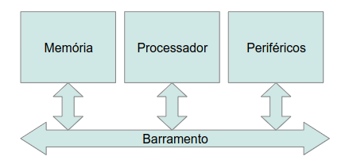

<figcaption style="text-align: center;">Figura 20 — Elementos básicos de um sistema computacional</figcaption>
</figure>

---

    Componentes Básicos de Um Sistema Computacional — Memória

- Nos sistemas computacionais as memórias podem ser classificadas em dois tipos:
    - Primárias — utilizadas para disponibilizar uma quantidade limitada de dados e instruções que estão em uso pelo processador.
    - Secundárias — utilizadas para armazenar grandes quantidades de dados dos programas e arquivos dos utilizadores de um computador.

- Nenhuma das memórias vistas até então, exceto a memória Flash, pode ser usada como memória secundária.
- A grande diferença entre as memórias primárias e secundárias é dada pelos seguintes fatores:
    - Velocidade de acesso — memórias primárias são mais rápidas que secundárias.
    - Capacidade de armazenamento — memórias secundárias armazenam mais dados que primárias.
    - Volatilidade — memórias secundárias não perdem os dados quando desenergizadas, enquanto as primárias perdem.
    - Custo — memórias secundárias são mais baratas que as primárias quando a capacidade é a métrica de avaliação.

São exemplos de memórias primárias:

- Memória RAM (composta por células capacitivas dinâmicas DRAM)
- Memória Cache — composta por células de *flip-flops* estáticas SRAM — mostrada na Figura 21.
- Memórias SRAM são mais rápidas que DRAM, mas são mais caras de se produzir, e portanto, menores.
    - Para que servem as memórias Cache?
    <!-- Resposta: para armazenar dados e instruções que são frequentemente acessados pelo processador, de forma a reduzir o tempo de acesso a esses dados e instruções. -->

São exemplos de memórias secundárias:

- Disco Rígido (mostrado na Figura 22)
- Memória Flash

<figure>

<!-- _class: transparent -->

<figcaption>Figura 21 — Memória cache ao lado de um processador</figcaption>
</figure>
<figure>

<!-- _class: transparent -->

<figcaption>Figura 22 — Disco rígido</figcaption>
</figure>

---

    Componentes Básicos de Um Sistema Computacional — Periféricos (Dispositivos de Entrada e Saída)

- Todos os sistemas computacionais devem ser capazes de se comunicar com o mundo exterior.
    - Para isso, eles utilizam periféricos, que são dispositivos de entrada e saída.
- Os periféricos podem ser classificados em:
    - Dispositivos de entrada (Teclado, mouse, scanner, etc.)
    - Dispositivos de saída (Monitor, impressora, etc.)
    - Dispositivos de entrada e saída bidirecionais (Telas touchscreen, por exemplo)

---

    Componentes Básicos de Um Sistema Computacional — Processador

O processador é o componente mais importante de um sistema computacional. Ele é responsável por executar as instruções de um programa, que são armazenadas na memória. O processador é composto por vários componentes, que são responsáveis por realizar as operações necessárias para a execução das instruções. Os principais componentes de um processador são:

- Unidade de Controle
- Unidade Lógica e Aritmética
- Registradores

A Unidade de Controle é responsável por controlar a execução das instruções. Ela é responsável por buscar as instruções na memória, decodificar as instruções e controlar a execução das instruções.

A Unidade Lógica e Aritmética é responsável por realizar as operações lógicas e aritméticas. Ela é responsável por realizar as operações de adição, subtração, multiplicação, divisão, comparação, entre outras.

Os Registradores são responsáveis por armazenar os dados temporários que são utilizados pela Unidade de Controle e pela Unidade Lógica e Aritmética.

---

    Componentes Básicos de Um Sistema Computacional — Barramento

- O barramento em um sistema computacional é o componente responsável por interligar os demais componentes do sistema;
- Em computador de mesa, a placa mãe — ilustrada pela Figura 23 — é o componente que implementa o barramento.

<figure>

<!-- _class: transparent -->
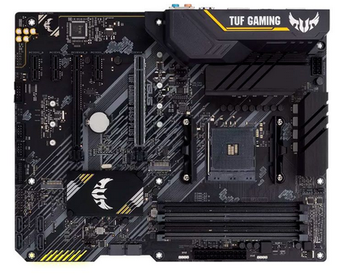

<figcaption style="text-align: center;">Figura 23 — Placa mãe</figcaption>
</figure>

---

<!-- _class: lead -->
# Revisão Sobre Arquitetura de Computadores
## Microprocessadores

---

## Microprocessadores — Arquitetura Interna

- Microprocessadores são a espinha dorsal de qualquer sistema computacional, seja ele de propósito genérico (computador de mesa, por exemplo) ou não.
- Cada Microprocessador apresenta suas particularidades, entretanto, certos aspectos são comuns a todos eles. A Figura 24 apresenta a arquitetura básica de um microprocessador com os aspectos comuns a todos:

<figure>

<!-- _class: transparent -->
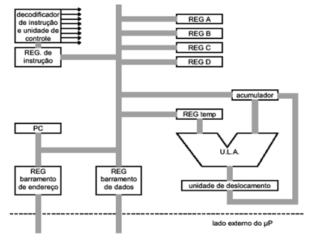

<figcaption style="text-align: center;">
Figura 24 - Arquitetura básica de um microprocessador
</figcaption>
</figure>

---

## Microprocessadores — Componentes Internos

### Registradores de Propósito Geral

- Como o próprio nome sugere, são utilizados para armazenar quaisquer dados usados pelo processador, tais quais: endereços de memória, dados, instruções, resultados de operações, etc.
- Nomeados de A até D (REG A, \\(\\cdots\\), REG D) no exemplo de arquitetura básica de processador estudado, como ilustrado pela Figura 25.
- O número de registradores varia de acordo com a arquitetura do processador.
    - No processador AVR, por exemplo, existem 32 registradores de 8 bits de propósito geral.
    - No Z80, existem 16 registradores de 8 bits de propósito geral.
    - No 8051 são 8 de 8 bits.

<figure>

<!-- _class: transparent -->

<figcaption>Figura 25 — Registradores de propósito geral.</figcaption>
</figure>

---

## Microprocessadores — Componentes Internos

### Unidade Lógica Aritmética (ULA)

- Unidade mais importante do processador, responsável pelas operações lógicas (comparações) e aritméticas (soma, subtração, multiplicação e divisão).
- Possui somador, subtrator (em alguns casos, multiplicador e divisor), operadores lógicos bit a bit `AND`, `OR`, `XOR`, incrementador e decrementador.
- Todos estes componentes integrados em apenas uma unidade.
    - Portanto, todas as operações lógicas e aritméticas passam pela ULA.
- A Figura 26 Ilustra a ULA com acumulador, registrador temporário e unidade de deslocamento interconectadas.

#### Registrador Temporário

- Registrador que armazena apenas um dos operadores da ULA.

#### Acumulador

- Registrador especial dedicado às operações da ULA.
- É um dos operandos envolvidos nas operações da ULA, como também, é o registrador que guarda os resultados das operações da ULA.

#### Unidade de Deslocamento

- É um componente sequencial da ULA responsável por realizar deslocamentos bidirecionais de bits (direita ou esquerda) dos resultados da ULA utilizando para tanto um registrador apropriado.

<figure>

<!-- _class: transparent -->

<figcaption>Figura 26 — Unidade Lógica Aritmética com acumulador, registrador temporário e unidade de deslocamento.</figcaption>
</figure>

---

## Microprocessadores — Componentes Internos

### Registradores de Endereço e de Dados

- O registrador de endereço é usado pelo processador para informar o endereço da memória onde os dados devem ser lidos ou escritos.
- O registrador de dados é usado para armazenar os dados que estão sendo lidos ou escritos da memória.
- A Figura 27 mostra os registradores de endereço e de dados.

### Registrador de Instrução

- É o registrador usado pelo processador para armazenar a instrução de execução lida da memória para que esta possa ser decodificada e executada pela unidade de controle (UC).

### Unidade de Controle (UC)

- É a unidade do processador capaz de converter instruções binárias, lidas da memória e armazenadas no registrador de instrução, em sinais de controle para a CPU que são enviados para os demais componentes do processador, direcionando sua operação.
    - A conversão das instruções em sinais de controle é realizada por meio de um decodificador binário, também conhecido como **decodificador de instrução**.
    - Uma vez convertidos os sinais de controle, a UC os envia de forma orquestrada para os demais componentes do processador de forma a realizar a execução desejada da instrução.
    - Se não fosse pela UC, o computador seria uma máquina de função única, não sendo capaz de executar instruções genéricas de propósitos igualmente genéricos. Portanto, pode-se considerar que a UC, representada na Figura 28, é o cérebro do processador e de todo sistema computacional.

### Program Counter (PC)

- É um registrador que armazena o endereço da próxima instrução a ser executada.
- O microprocessador usa o conteúdo deste registrador para informar a memória o endereço de onde encontra-se a próxima instrução.
    - O \\(\\mu \\text{P}\\) faz a leitura da instrução e a armazena no registrador de instrução.
- Após a leitura da instrução, o PC é incrementado para apontar para a próxima instrução a ser executada.

<figure>

<!-- _class: transparent -->

<figcaption style="text-align: center;">Figura 27 — Registradores de endereço e de dados.</figcaption>
</figure>
<figure>

<!-- _class: transparent -->

<figcaption style="text-align: center;">Figura 28 — Unidade de controle, decodificador de instrução e registrador de instrução</figcaption>
</figure>
<figure>

<!-- _class: transparent -->

<figcaption style="text-align: center;">Figura 29 — Registrador Program Counter (PC)</figcaption>
</figure>

---

## Microprocessadores — Arquitetura Harvard vs Von Neumann

- As arquiteturas Harvard e Von Neumann são dois modelos de arquitetura de processadores que diferem na forma como a memória principal é disponibilizada para o processador. 

- A arquitetura Harvard é uma arquitetura que separa a memória em duas partes distintas, uma para armazenar dados e outra para armazenar instruções, como ilustrado pela Figura 30.

- A arquitetura Von Neumann, por outro lado, utiliza uma única memória para armazenar tanto dados quanto instruções, como ilustrado pela Figura 31.

<figure>

<!-- _class: transparent -->

<figcaption style="text-align: center;">Figura 30 - Arquitetura Harvard</figcaption>
</figure>

<figure>

<!-- _class: transparent -->
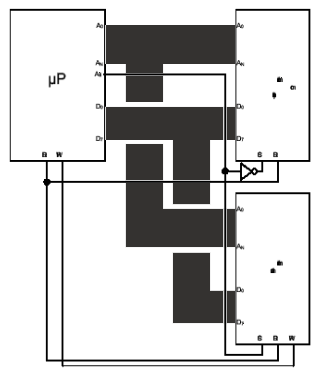

<figcaption style="text-align: center;">Figura 31 - Arquitetura Von Neumann</figcaption>
</figure>

